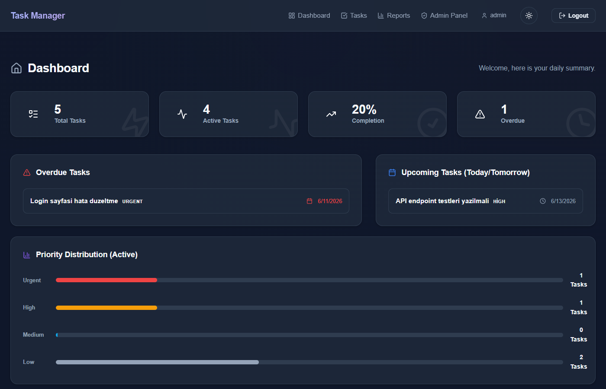
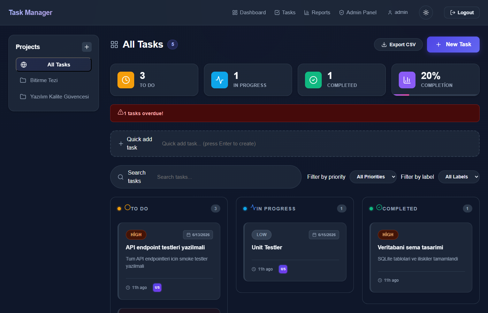
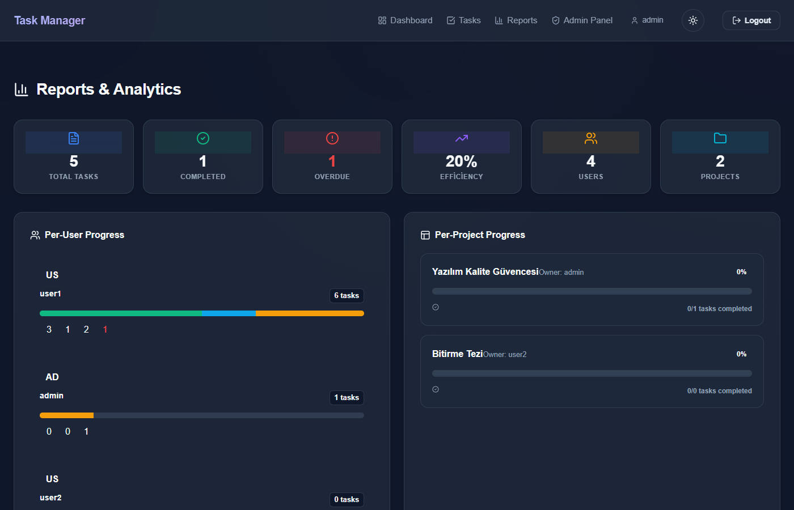

# Dönem Projesi - Görev Yöneticisi (Task Manager) API

## Proje Açıklaması

Bu proje, Yazılım Kalite Güvencesi dersi kapsamında geliştirilmiş bir görev yönetimi (Task Manager) REST API uygulamasıdır. TypeScript, Node.js ve Express çatısı kullanılarak geliştirilen bu API; kullanıcıların görev oluşturmasına, güncellemesine, listelemesine ve silmesine olanak tanır. Kimlik doğrulama ve yetkilendirme mekanizmalarını da içeren, tam işlevsel bir arka uç (backend) servisi sunar.

## Ekran Görüntüleri

<div align="center">
  
  <br/><br/>
  
  <br/><br/>
  
</div>

## Mimari Genel Bakış

Uygulama, katmanlı mimari (layered architecture) ilkelerine göre tasarlanmıştır. Sunum katmanı, Express Router'ları ile tanımlanan HTTP uç noktalarını (endpoint) içerirken; iş mantığı `services/` dizini altındaki ayrı servis modüllerinde yer alır. Bu yaklaşım, kodun test edilebilirliğini ve bakımını önemli ölçüde kolaylaştırır.

Veritabanı katmanında, `better-sqlite3` kütüphanesi kullanılarak senkron SQLite işlemleri gerçekleştirilir. `db.ts` modülü, uygulama başladığında tabloları otomatik olarak oluşturur ve WAL (Write-Ahead Logging) modu etkinleştirilerek performans optimize edilir. Yabancı anahtar (foreign key) kısıtlamaları da açıkça etkinleştirilmiştir.

Kimlik doğrulama, `express-session` ara katmanı (middleware) aracılığıyla sunucu taraflı oturum yönetimi ile sağlanır. Oturum kimliği (session ID) `httpOnly` bir çerezde saklanır ve bu sayede XSS saldırılarına karşı koruma sağlanır. Kullanıcı parolaları, veritabanında saklanmadan önce `bcrypt` ile hash'lenerek güvenlik güçlendirilir.

Test altyapısı Vitest ve Supertest üzerine kuruludur. Birim testleri (unit tests), servis fonksiyonlarını izole ve bellek-içi (in-memory) veritabanlarıyla test ederken; smoke testleri gerçek HTTP istekleri göndererek uçtan uca akışı doğrular. Bu iki katmanlı test stratejisi, hem tekil bileşenlerin hem de sistemin bütününün doğru çalıştığını güvence altına alır.

## Kurulum ve Çalıştırma

### Ön Gereksinimler

- Node.js >= 18.x
- npm >= 9.x

### Adımlar

```bash
# Bağımlılıkları yükle
npm install

# Veritabanını başlangıç verileriyle doldur
npm run seed

# Geliştirme modunda başlat
npm run dev

# Üretim için derle
npm run build

# Derlenmiş uygulamayı çalıştır
npm start
```

## Varsayılan Kullanıcılar (Seed)

`npm run seed` komutu çalıştırıldıktan sonra aşağıdaki kullanıcılar oluşturulur:

| Kullanıcı Adı | Parola    | Rol   |
|---------------|-----------|-------|
| admin         | Admin123! | admin |
| user1         | User123!  | user  |

Seed ayrıca 3 örnek görev oluşturur: biri "todo", biri "in-progress", biri de "done" durumunda.

## Oturum Yönetimi Tercihi

Oturum yönetimi için JWT yerine sunucu taraflı `express-session` tercih edilmiştir. Bu kararın temel nedeni güvenlik odaklıdır: oturum verisi sunucuda saklandığından, bir oturumu geçersiz kılmak (örneğin bir kullanıcıyı zorla çıkış yaptırmak) anında mümkündür. JWT tabanlı bir yaklaşımda ise token'ın süresi dolana kadar geçersiz kılma mümkün olmaz. Oturum kimliği `httpOnly` bir çerezde taşınır ve JavaScript erişimini engelleyerek XSS saldırılarına karşı ek koruma sağlar.

## Veritabanı Tercihi

Veritabanı olarak SQLite (`better-sqlite3`) seçilmiştir. Bu tercih, uygulamanın bağımsız olarak (ek bir veritabanı sunucusu gerektirmeden) çalışmasına olanak tanır ve özellikle geliştirme ortamlarında kurulum karmaşasını ortadan kaldırır. `better-sqlite3` kütüphanesi senkron bir API sunduğu için kod okunabilirliği artar ve async/await karmaşıklığından kaçınılır. Eşzamanlı okuma performansını iyileştirmek için WAL modu etkinleştirilmiştir.

## Test Komutları

```bash
# Tüm testleri çalıştır
npm test

# Yalnızca smoke testlerini çalıştır
npm run test:smoke

# Yalnızca birim testlerini çalıştır
npm run test:unit
```

## Test Kayıtları

`npm test` çıktısı (98/98 test geçti):

```
  ✓ tests/smoke/api.smoke.test.ts (31)
  ✓ tests/unit/taskService.test.ts (24)
  ✓ tests/unit/reportService.test.ts (8)
  ✓ tests/unit/labelService.test.ts (9)
  ✓ tests/unit/commentService.test.ts (8)
  ✓ tests/unit/projectService.test.ts (7)
  ✓ tests/unit/authService.test.ts (10)

 Test Files  7 passed (7)
      Tests  98 passed (98)
   Start at  14:50:04
   Duration  1.30s (transform 189ms, setup 1ms, collect 594ms, tests 420ms, environment 0ms, prepare 131ms)
```

## Testler

Bu projede kalite güvencesi kapsamında iki temel test seviyesi uygulanmıştır: Birim Testleri (Unit Tests) ve Smoke Testleri.

### Smoke Testleri

Smoke testleri, uygulamanın en kritik işlevlerinin uçtan uca doğru çalışıp çalışmadığını doğrular. `tests/smoke/api.smoke.test.ts` içindeki 31 senaryo şunları kapsar:

1.  **Kimlik Doğrulama:** Kayıt, giriş ve oturum çerezi doğrulaması.
2.  **Yetkilendirme:** Giriş yapmadan korumalı uç noktalara erişimin engellenmesi ve yalnızca admin'e özel uç nokta testleri.
3.  **Temel Varlık (Görev) CRUD:** Görev oluşturma, listeleme, detay görüntüleme, güncelleme ve silme akışları.
4.  **Doğrulama (Validation):** Geçersiz veri içeren isteklerin (örneğin boş başlık) 400 hatasıyla reddedilmesi.
5.  **Ek Özellikler:** Yorum ekleme/silme, etiket yönetimi, alt görev oluşturma ve proje bazlı yönetim.
6.  **Raporlama:** İstatistik ve özet raporlarına yetkili erişim.

### Birim Testleri

Birim testleri, servis katmanındaki iş kurallarını ve veri doğrulama mantığını, veritabanı veya ağ bağımlılığı olmadan (bellek-içi DB ile) izole biçimde test eder. Toplam 67 birim testi şu konuları içerir:

-   **Doğrulama / İş Kuralları:** `taskService`, `authService`, `labelService` vb. içindeki girdi doğrulama fonksiyonları (boş değer, uzunluk, format kontrolü).
-   **Yetkilendirme Kararı:** `authService` içinde rol tabanlı (admin/user) erişim izinleri.
-   **Hata Durumları:** Servis seviyesinde yönetilen kaynak bulunamadı (404), yetkisiz erişim (403) ve çakışma durumları.
-   **Servis Mantığı:** Temel varlığın ve yardımcı varlıkların (etiket, yorum, proje) veritabanı ile CRUD etkileşimleri ve karmaşık istatistik hesaplama algoritmaları (`reportService`).

## API Uç Nokta (Endpoint) Dokümantasyonu

### Kimlik Doğrulama

| Metot | Uç Nokta            | Açıklama                  | Erişim       |
|-------|---------------------|---------------------------|--------------|
| POST  | /api/auth/register  | Yeni kullanıcı kaydı      | Herkese açık |
| POST  | /api/auth/login     | Giriş, oturum oluşturma   | Herkese açık |
| POST  | /api/auth/logout    | Oturumu sonlandırma       | Giriş yapmış |
| GET   | /api/auth/me        | Mevcut oturum bilgisi     | Giriş yapmış |

#### POST /api/auth/register
```json
{
  "username": "johndoe",
  "email": "john@example.com",
  "password": "Pass123!"
}
```

#### POST /api/auth/login
```json
{
  "username": "johndoe",
  "password": "Pass123!"
}
```

### Görevler (Tasks)

Tüm görev uç noktaları kimlik doğrulaması gerektirir.

| Metot  | Uç Nokta         | Açıklama              | Erişim       |
|--------|------------------|-----------------------|--------------|
| GET    | /api/tasks       | Tüm görevleri listele | Giriş yapmış |
| POST   | /api/tasks       | Yeni görev oluştur    | Giriş yapmış |
| GET    | /api/tasks/:id   | Tek görev getir       | Giriş yapmış |
| PATCH  | /api/tasks/:id   | Görevi güncelle       | Giriş yapmış |
| DELETE | /api/tasks/:id   | Görevi sil            | Giriş yapmış |

#### POST /api/tasks — Görev Oluştur
```json
{
  "title": "Görev başlığı",
  "description": "Opsiyonel açıklama",
  "status": "todo"
}
```
Geçerli `status` değerleri: `todo`, `in-progress`, `done`

#### PATCH /api/tasks/:id — Görevi Güncelle
```json
{
  "title": "Yeni başlık",
  "status": "in-progress"
}
```

### Admin

Yalnızca `admin` rolüne sahip kullanıcılar erişebilir.

| Metot | Uç Nokta          | Açıklama                       | Erişim |
|-------|-------------------|--------------------------------|--------|
| GET   | /api/admin/users  | Tüm kullanıcıları listele      | Admin  |
| GET   | /api/admin/stats  | Kullanıcı ve görev istatistiği | Admin  |

### Sistem

| Metot | Uç Nokta  | Açıklama               |
|-------|-----------|------------------------|
| GET   | /health   | Servis sağlık kontrolü |

## Hata Yanıtları

Doğrulama hataları için:
```json
{
  "errors": [
    { "field": "title", "message": "Title is required" }
  ]
}
```

Genel hatalar için:
```json
{
  "error": "Hata mesajı"
}
```

## HTTP Durum Kodları

| Kod | Açıklama                                     |
|-----|----------------------------------------------|
| 200 | Başarılı                                      |
| 201 | Kaynak oluşturuldu                            |
| 204 | Başarılı, içerik yok (silme)                  |
| 400 | Geçersiz istek / doğrulama hatası             |
| 401 | Kimlik doğrulama gerekli                      |
| 403 | Yetkisiz erişim                               |
| 404 | Kaynak bulunamadı                             |
| 409 | Çakışma (kullanıcı adı/e-posta zaten mevcut)  |
| 500 | Sunucu hatası                                 |

## Opsiyonel Arayüz (BONUS)

React + Vite ile geliştirilmiş bir kullanıcı arayüzü `client/` dizininde yer alır.

### Arayüz Kurulumu ve Çalıştırma

```bash
cd client
npm install
npm run dev
```

Tarayıcınızda http://localhost:5173 adresini açın. Arka ucun (3000 portu) çalışıyor olması gerekir.

### Arayüz Özellikleri
- Giriş ve kayıt sayfaları
- Görev listesi: oluşturma, düzenleme, silme
- Durum rozetleri (Yapılacak / Devam Ediyor / Tamamlandı)
- Admin paneli: kullanıcı listesi ve istatistikler (yalnızca admin rolü)
